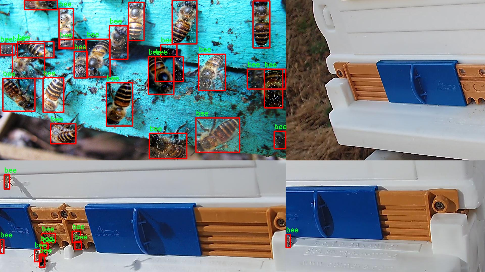

# 改进yolo11-dysample等200+全套创新点大全：蜜蜂检测系统源码＆数据集全套

### 1.图片效果展示


##### 项目来源 **[人工智能促进会 2024.10.30](https://kdocs.cn/l/cszuIiCKVNis)**

注意：由于项目一直在更新迭代，上面“1.图片效果展示”和“2.视频效果展示”展示的系统图片或者视频可能为老版本，新版本在老版本的基础上升级如下：（实际效果以升级的新版本为准）

  （1）适配了YOLOV11的“目标检测”模型和“实例分割”模型，通过加载相应的权重（.pt）文件即可自适应加载模型。

  （2）支持“图片识别”、“视频识别”、“摄像头实时识别”三种识别模式。

  （3）支持“图片识别”、“视频识别”、“摄像头实时识别”三种识别结果保存导出，解决手动导出（容易卡顿出现爆内存）存在的问题，识别完自动保存结果并导出到tempDir中。

  （4）支持Web前端系统中的标题、背景图等自定义修改。

  另外本项目提供训练的数据集和训练教程,暂不提供权重文件（best.pt）,需要您按照教程进行训练后实现图片演示和Web前端界面演示的效果。

### 2.视频效果展示

[2.1 视频效果展示](https://www.bilibili.com/video/BV1oJSEY1Edc/)

### 3.背景

研究背景与意义

随着全球生态环境的变化和人类活动的影响，蜜蜂作为重要的授粉昆虫，其数量和种群健康状况日益受到关注。蜜蜂不仅在农业生产中扮演着不可或缺的角色，还对维持生态系统的平衡具有重要意义。然而，蜜蜂种群的减少已成为全球范围内的一个严峻问题，影响了作物的产量和生物多样性。因此，开发有效的蜜蜂监测与保护系统显得尤为重要。近年来，计算机视觉技术的快速发展为蜜蜂的检测与监测提供了新的思路。

本研究旨在基于改进的YOLOv11模型，构建一个高效的蜜蜂检测系统。YOLO（You Only Look Once）系列模型因其实时性和高精度的特点，广泛应用于物体检测领域。通过对YOLOv11的改进，我们可以提高蜜蜂检测的准确性和速度，从而实现对蜜蜂种群动态的实时监测。该系统将利用一个包含909张图像的数据集，专注于蜜蜂的不同种类，包括工蜂、雄蜂、花粉蜂和蜂后。这一数据集的多样性为模型的训练提供了丰富的样本，有助于提升模型的泛化能力。

通过本研究，期望能够为蜜蜂的保护与管理提供技术支持，促进蜜蜂种群的监测与研究。同时，构建的蜜蜂检测系统也可以为农业生产提供科学依据，帮助农民更好地理解蜜蜂的行为和生态需求，进而采取相应的保护措施。总之，本研究不仅具有重要的学术价值，也对生态保护和可持续农业发展具有深远的现实意义。

### 4.数据集信息展示

##### 4.1 本项目数据集详细数据（类别数＆类别名）

nc: 4
names: ['bee', 'drone', 'pollenbee', 'queen']


该项目为【目标检测】数据集，请在【训练教程和Web端加载模型教程（第三步）】这一步的时候按照【目标检测】部分的教程来训练

##### 4.2 本项目数据集信息介绍

本项目数据集信息介绍

本项目旨在改进YOLOv11的蜜蜂检测系统，所使用的数据集名为“Honey Bee Detection Model”。该数据集专门针对蜜蜂及其相关种类进行标注，具有丰富的多样性和高质量的图像数据，适合用于深度学习模型的训练与评估。数据集中包含四个主要类别，分别为“bee”（工蜂）、“drone”（雄蜂）、“pollenbee”（采花蜂）和“queen”（蜂后）。这些类别的选择不仅反映了蜜蜂群体的基本构成，也为蜜蜂行为和生态研究提供了重要的基础。

数据集中的图像涵盖了不同环境、不同光照条件下的蜜蜂，确保了模型在实际应用中的鲁棒性。每个类别的样本数量经过精心设计，以保证模型在训练过程中能够有效学习到各类蜜蜂的特征。工蜂作为蜜蜂群体中最为常见的成员，其在花朵上采蜜的行为被广泛记录；雄蜂则在繁殖季节扮演着重要角色，而采花蜂则是蜜蜂生态系统中不可或缺的一部分，负责授粉和蜜源的获取。蜂后作为整个蜂群的核心，其独特的生理特征和行为模式也被充分捕捉并标注。

通过使用“Honey Bee Detection Model”数据集，研究人员能够训练出更为精准的蜜蜂检测系统，进而推动蜜蜂保护和生态监测的相关研究。该数据集不仅为蜜蜂的分类和识别提供了基础数据支持，还为未来的蜜蜂行为分析和生态研究奠定了坚实的基础。随着数据集的不断扩展和优化，期望能够在蜜蜂保护和农业可持续发展方面发挥更大的作用。





### 5.全套项目环境部署视频教程（零基础手把手教学）

[5.1 所需软件PyCharm和Anaconda安装教程（第一步）](https://www.bilibili.com/video/BV1BoC1YCEKi/?spm_id_from=333.999.0.0&vd_source=bc9aec86d164b67a7004b996143742dc)


[5.2 安装Python虚拟环境创建和依赖库安装视频教程（第二步）](https://www.bilibili.com/video/BV1ZoC1YCEBw?spm_id_from=333.788.videopod.sections&vd_source=bc9aec86d164b67a7004b996143742dc)

### 6.改进YOLOv11训练教程和Web_UI前端加载模型教程（零基础手把手教学）

[6.1 改进YOLOv11训练教程和Web_UI前端加载模型教程（第三步）](https://www.bilibili.com/video/BV1BoC1YCEhR?spm_id_from=333.788.videopod.sections&vd_source=bc9aec86d164b67a7004b996143742dc)


按照上面的训练视频教程链接加载项目提供的数据集，运行train.py即可开始训练



     Epoch   gpu_mem       box       obj       cls    labels  img_size
     1/200     20.8G   0.01576   0.01955  0.007536        22      1280: 100%|██████████| 849/849 [14:42<00:00,  1.04s/it]
               Class     Images     Labels          P          R     mAP@.5 mAP@.5:.95: 100%|██████████| 213/213 [01:14<00:00,  2.87it/s]
                 all       3395      17314      0.994      0.957      0.0957      0.0843

     Epoch   gpu_mem       box       obj       cls    labels  img_size
     2/200     20.8G   0.01578   0.01923  0.007006        22      1280: 100%|██████████| 849/849 [14:44<00:00,  1.04s/it]
               Class     Images     Labels          P          R     mAP@.5 mAP@.5:.95: 100%|██████████| 213/213 [01:12<00:00,  2.95it/s]
                 all       3395      17314      0.996      0.956      0.0957      0.0845

     Epoch   gpu_mem       box       obj       cls    labels  img_size
     3/200     20.8G   0.01561    0.0191  0.006895        27      1280: 100%|██████████| 849/849 [10:56<00:00,  1.29it/s]
               Class     Images     Labels          P          R     mAP@.5 mAP@.5:.95: 100%|███████   | 187/213 [00:52<00:00,  4.04it/s]
                 all       3395      17314      0.996      0.957      0.0957      0.0845


###### [项目数据集下载链接](https://kdocs.cn/l/cszuIiCKVNis)

### 7.原始YOLOv11算法讲解

##### YOLO11简介

> YOLO11源码地址：https://github.com/ultralytics/ultralytics

Ultralytics
YOLO11是一款尖端的、最先进的模型，它在之前YOLO版本成功的基础上进行了构建，并引入了新功能和改进，以进一步提升性能和灵活性。YOLO11设计快速、准确且易于使用，使其成为各种物体检测和跟踪、实例分割、图像分类以及姿态估计任务的绝佳选择。  


**YOLO11创新点如下:**

YOLO 11主要改进包括：  
`增强的特征提取`：YOLO 11采用了改进的骨干和颈部架构，增强了特征提取功能，以实现更精确的目标检测。  
`优化的效率和速度`：优化的架构设计和优化的训练管道提供更快的处理速度，同时保持准确性和性能之间的平衡。  
`更高的精度，更少的参数`：YOLO11m在COCO数据集上实现了更高的平均精度（mAP），参数比YOLOv8m少22%，使其在不影响精度的情况下提高了计算效率。  
`跨环境的适应性`：YOLO 11可以部署在各种环境中，包括边缘设备、云平台和支持NVIDIA GPU的系统。  
`广泛的支持任务`：YOLO 11支持各种计算机视觉任务，如对象检测、实例分割、图像分类、姿态估计和面向对象检测（OBB）。

**YOLO11不同模型尺寸信息：**

YOLO11 提供5种不同的型号规模模型，以满足不同的应用需求：

Model| size (pixels)| mAPval 50-95| Speed CPU ONNX (ms)| Speed T4 TensorRT10
(ms)| params (M)| FLOPs (B)  
---|---|---|---|---|---|---  
YOLO11n| 640| 39.5| 56.1 ± 0.8| 1.5 ± 0.0| 2.6| 6.5  
YOLO11s| 640| 47.0| 90.0 ± 1.2| 2.5 ± 0.0| 9.4| 21.5  
YOLO11m| 640| 51.5| 183.2 ± 2.0| 4.7 ± 0.1| 20.1| 68.0  
YOLO11l| 640| 53.4| 238.6 ± 1.4| 6.2 ± 0.1| 25.3| 86.9  
YOLO11x| 640| 54.7| 462.8 ± 6.7| 11.3 ± 0.2| 56.9| 194.9  
  
**模型常用训练超参数参数说明：**  
`YOLOv11
模型的训练设置包括训练过程中使用的各种超参数和配置`。这些设置会影响模型的性能、速度和准确性。关键的训练设置包括批量大小、学习率、动量和权重衰减。此外，优化器、损失函数和训练数据集组成的选择也会影响训练过程。对这些设置进行仔细的调整和实验对于优化性能至关重要。  
**以下是一些常用的模型训练参数和说明：**

参数名| 默认值| 说明  
---|---|---  
`model`| `None`| 指定用于训练的模型文件。接受指向 `.pt` 预训练模型或 `.yaml`
配置文件。对于定义模型结构或初始化权重至关重要。  
`data`| `None`| 数据集配置文件的路径（例如
`coco8.yaml`).该文件包含特定于数据集的参数，包括训练数据和验证数据的路径、类名和类数。  
`epochs`| `100`| 训练总轮数。每个epoch代表对整个数据集进行一次完整的训练。调整该值会影响训练时间和模型性能。  
`patience`| `100`| 在验证指标没有改善的情况下，提前停止训练所需的epoch数。当性能趋于平稳时停止训练，有助于防止过度拟合。  
`batch`| `16`| 批量大小，有三种模式:设置为整数(例如，’ Batch =16 ‘)， 60% GPU内存利用率的自动模式(’ Batch
=-1 ‘)，或指定利用率分数的自动模式(’ Batch =0.70 ')。  
`imgsz`| `640`| 用于训练的目标图像尺寸。所有图像在输入模型前都会被调整到这一尺寸。影响模型精度和计算复杂度。  
`device`| `None`| 指定用于训练的计算设备：单个 GPU (`device=0`）、多个 GPU (`device=0,1`)、CPU
(`device=cpu`)，或苹果芯片的 MPS (`device=mps`).  
`workers`| `8`| 加载数据的工作线程数（每 `RANK` 多 GPU 训练）。影响数据预处理和输入模型的速度，尤其适用于多 GPU 设置。  
`name`| `None`| 训练运行的名称。用于在项目文件夹内创建一个子目录，用于存储训练日志和输出结果。  
`pretrained`| `True`| 决定是否从预处理模型开始训练。可以是布尔值，也可以是加载权重的特定模型的字符串路径。提高训练效率和模型性能。  
`optimizer`| `'auto'`| 为训练模型选择优化器。选项包括 `SGD`, `Adam`, `AdamW`, `NAdam`,
`RAdam`, `RMSProp` 等，或 `auto` 用于根据模型配置进行自动选择。影响收敛速度和稳定性  
`lr0`| `0.01`| 初始学习率（即 `SGD=1E-2`, `Adam=1E-3`) .调整这个值对优化过程至关重要，会影响模型权重的更新速度。  
`lrf`| `0.01`| 最终学习率占初始学习率的百分比 = (`lr0 * lrf`)，与调度程序结合使用，随着时间的推移调整学习率。  


**各损失函数作用说明：**  
`定位损失box_loss`：预测框与标定框之间的误差（GIoU），越小定位得越准；  
`分类损失cls_loss`：计算锚框与对应的标定分类是否正确，越小分类得越准；  
`动态特征损失（dfl_loss）`：DFLLoss是一种用于回归预测框与目标框之间距离的损失函数。在计算损失时，目标框需要缩放到特征图尺度，即除以相应的stride，并与预测的边界框计算Ciou
Loss，同时与预测的anchors中心点到各边的距离计算回归DFLLoss。  


### 8.200+种全套改进YOLOV11创新点原理讲解

#### 8.1 200+种全套改进YOLOV11创新点原理讲解大全

由于篇幅限制，每个创新点的具体原理讲解就不全部展开，具体见下列网址中的改进模块对应项目的技术原理博客网址【Blog】（创新点均为模块化搭建，原理适配YOLOv5~YOLOv11等各种版本）

[改进模块技术原理博客【Blog】网址链接](https://gitee.com/qunmasj/good)


#### 8.2 精选部分改进YOLOV11创新点原理讲解

###### 这里节选部分改进创新点展开原理讲解(完整的改进原理见上图和[改进模块技术原理博客链接](https://gitee.com/qunmasj/good)【如果此小节的图加载失败可以通过CSDN或者Github搜索该博客的标题访问原始博客，原始博客图片显示正常】
### FasterNet简介
神经网络在图像分类、检测和分割等各种计算机视觉任务中经历了快速发展。尽管其令人印象深刻的性能为许多应用程序提供了动力，但一个巨大的趋势是追求具有低延迟和高吞吐量的快速神经网络，以获得良好的用户体验、即时响应和安全原因等。

如何快速？研究人员和从业者不需要更昂贵的计算设备，而是倾向于设计具有成本效益的快速神经网络，降低计算复杂度，主要以浮点运算（FLOPs）的数量来衡量。

MobileNet、ShuffleNet和GhostNet等利用深度卷积（DWConv）和/或组卷积（GConv）来提取空间特征。然而，在减少FLOPs的过程中，算子经常会受到内存访问增加的副作用的影响。MicroNet进一步分解和稀疏网络，将其FLOPs推至极低水平。尽管这种方法在FLOPs方面有所改进，但其碎片计算效率很低。此外，上述网络通常伴随着额外的数据操作，如级联、Shuffle和池化，这些操作的运行时间对于小型模型来说往往很重要。

除了上述纯卷积神经网络（CNNs）之外，人们对使视觉Transformer（ViTs）和多层感知器（MLP）架构更小更快也越来越感兴趣。例如，MobileViT和MobileFormer通过将DWConv与改进的注意力机制相结合，降低了计算复杂性。然而，它们仍然受到DWConv的上述问题的困扰，并且还需要修改的注意力机制的专用硬件支持。使用先进但耗时的标准化和激活层也可能限制其在设备上的速度。

所有这些问题一起导致了以下问题：这些“快速”的神经网络真的很快吗？为了回答这个问题，作者检查了延迟和FLOPs之间的关系，这由


其中FLOPS是每秒浮点运算的缩写，作为有效计算速度的度量。虽然有许多减少FLOPs的尝试，但都很少考虑同时优化FLOPs以实现真正的低延迟。为了更好地理解这种情况，作者比较了Intel CPU上典型神经网络的FLOPS。


图中的结果表明，许多现有神经网络的FLOPS较低，其FLOPS通常低于流行的ResNet50。由于FLOPS如此之低，这些“快速”的神经网络实际上不够快。它们的FLOPs减少不能转化为延迟的确切减少量。在某些情况下，没有任何改善，甚至会导致更糟的延迟。例如，CycleMLP-B1具有ResNet50的一半FLOPs，但运行速度较慢（即CycleMLPB1与ResNet50:111.9ms与69.4ms）。

请注意，FLOPs与延迟之间的差异在之前的工作中也已被注意到，但由于它们采用了DWConv/GConv和具有低FLOPs的各种数据处理，因此部分问题仍未解决。人们认为没有更好的选择。

该博客提供的方案通过开发一种简单、快速、有效的运算符来消除这种差异，该运算符可以在减少FLOPs的情况下保持高FLOPS。

具体来说，作者重新审视了现有的操作符，特别是DWConv的计算速度——FLOPS。作者发现导致低FLOPS问题的主要原因是频繁的内存访问。然后，作者提出了PConv作为一种竞争性替代方案，它减少了计算冗余以及内存访问的数量。

图1说明了PConv的设计。它利用了特征图中的冗余，并系统地仅在一部分输入通道上应用规则卷积（Conv），而不影响其余通道。本质上，PConv的FLOPs低于常规Conv，而FLOPs高于DWConv/GConv。换句话说，PConv更好地利用了设备上的计算能力。PConv在提取空间特征方面也很有效，这在本文后面的实验中得到了验证。

作者进一步引入PConv设计了FasterNet作为一个在各种设备上运行速度非常快的新网络家族。特别是，FasterNet在分类、检测和分割任务方面实现了最先进的性能，同时具有更低的延迟和更高的吞吐量。例如，在GPU、CPU和ARM处理器上，小模型FasterNet-T0分别比MobileVitXXS快3.1倍、3.1倍和2.5倍，而在ImageNet-1k上的准确率高2.9%。大模型FasterNet-L实现了83.5%的Top-1精度，与Swin-B不相上下，同时在GPU上提供了49%的高吞吐量，在CPU上节省了42%的计算时间。

总之，贡献如下：

指出了实现更高FLOPS的重要性，而不仅仅是为了更快的神经网络而减少FLOPs。

引入了一种简单但快速且有效的卷积PConv，它很有可能取代现有的选择DWConv。

推出FasterNet，它在GPU、CPU和ARM处理器等多种设备上运行良好且普遍快速。

对各种任务进行了广泛的实验，并验证了PConv和FasterNet的高速性和有效性。

### Conv和FasterNet的设计
#### 原理

DWConv是Conv的一种流行变体，已被广泛用作许多神经网络的关键构建块。对于输入，DWConv应用个滤波器来计算输出。如图（b）所示，每个滤波器在一个输入通道上进行空间滑动，并对一个输出通道做出贡献。

与具有的FLOPs常规Conv相比，这种深度计算使得DWConv仅仅具有的FLOPs。虽然在减少FLOPs方面有效，但DWConv（通常后跟逐点卷积或PWConv）不能简单地用于替换常规Conv，因为它会导致严重的精度下降。因此，在实践中，DWConv的通道数（或网络宽度）增加到＞以补偿精度下降，例如，倒置残差块中的DWConv宽度扩展了6倍。然而，这会导致更高的内存访问，这会造成不可忽略的延迟，并降低总体计算速度，尤其是对于I/O绑定设备。特别是，内存访问的数量现在上升到


它比一个常规的Conv的值要高，即，


注意，内存访问花费在I/O操作上，这被认为已经是最小的成本，很难进一步优化。

#### PConv作为一个基本的算子


在下面演示了通过利用特征图的冗余度可以进一步优化成本。如图所示，特征图在不同通道之间具有高度相似性。许多其他著作也涵盖了这种冗余，但很少有人以简单而有效的方式充分利用它。


具体而言，作者提出了一种简单的PConv，以同时减少计算冗余和内存访问。图4中的左下角说明了PConv的工作原理。它只需在输入通道的一部分上应用常规Conv进行空间特征提取，并保持其余通道不变。对于连续或规则的内存访问，将第一个或最后一个连续的通道视为整个特征图的代表进行计算。在不丧失一般性的情况下认为输入和输出特征图具有相同数量的通道。因此，PConv的FLOPs仅


对于典型的r＝1/4 ，PConv的FLOPs只有常规Conv的1/16。此外，PConv的内存访问量较小，即：


对于r＝1/4，其仅为常规Conv的1/4。

由于只有通道用于空间特征提取，人们可能会问是否可以简单地移除剩余的（c−）通道？如果是这样，PConv将退化为具有较少通道的常规Conv，这偏离了减少冗余的目标。

请注意，保持其余通道不变，而不是从特征图中删除它们。这是因为它们对后续PWConv层有用，PWConv允许特征信息流经所有通道。

#### PConv之后是PWConv


为了充分有效地利用来自所有通道的信息，进一步将逐点卷积（PWConv）附加到PConv。它们在输入特征图上的有效感受野看起来像一个T形Conv，与均匀处理补丁的常规Conv相比，它更专注于中心位置，如图5所示。为了证明这个T形感受野的合理性，首先通过计算位置的Frobenius范数来评估每个位置的重要性。


假设，如果一个职位比其他职位具有更大的Frobenius范数，则该职位往往更重要。对于正则Conv滤波器，位置处的Frobenius范数由计算，其中。


一个显著位置是具有最大Frobenius范数的位置。然后，在预训练的ResNet18中集体检查每个过滤器，找出它们的显著位置，并绘制显著位置的直方图。图6中的结果表明，中心位置是过滤器中最常见的突出位置。换句话说，中心位置的权重比周围的更重。这与集中于中心位置的T形计算一致。

虽然T形卷积可以直接用于高效计算，但作者表明，将T形卷积分解为PConv和PWConv更好，因为该分解利用了滤波器间冗余并进一步节省了FLOPs。对于相同的输入和输出，T形Conv的FLOPs可以计算为:


它高于PConv和PWConv的流量，即：


其中和（例如，当时）。此外，可以很容易地利用常规Conv进行两步实现。

# FasterNet作为Backbone
鉴于新型PConv和现成的PWConv作为主要的算子，进一步提出FasterNet，这是一个新的神经网络家族，运行速度非常快，对许多视觉任务非常有效。目标是使体系结构尽可能简单，使其总体上对硬件友好。


在图中展示了整体架构。它有4个层次级，每个层次级前面都有一个嵌入层（步长为4的常规4×4卷积）或一个合并层（步长为2的常规2×2卷积），用于空间下采样和通道数量扩展。每个阶段都有一堆FasterNet块。作者观察到，最后两个阶段中的块消耗更少的内存访问，并且倾向于具有更高的FLOPS，如表1中的经验验证。因此，放置了更多FasterNet块，并相应地将更多计算分配给最后两个阶段。每个FasterNet块有一个PConv层，后跟2个PWConv（或Conv 1×1）层。它们一起显示为倒置残差块，其中中间层具有扩展的通道数量，并且放置了Shorcut以重用输入特征。

除了上述算子，标准化和激活层对于高性能神经网络也是不可或缺的。然而，许多先前的工作在整个网络中过度使用这些层，这可能会限制特征多样性，从而损害性能。它还可以降低整体计算速度。相比之下，只将它们放在每个中间PWConv之后，以保持特征多样性并实现较低的延迟。

此外，使用批次归一化（BN）代替其他替代方法。BN的优点是，它可以合并到其相邻的Conv层中，以便更快地进行推断，同时与其他层一样有效。对于激活层，根据经验选择了GELU用于较小的FasterNet变体，而ReLU用于较大的FasterNet变体，同时考虑了运行时间和有效性。最后三个层，即全局平均池化、卷积1×1和全连接层，一起用于特征转换和分类。

为了在不同的计算预算下提供广泛的应用，提供FasterNet的Tiny模型、Small模型、Medium模型和Big模型变体，分别称为FasterNetT0/1/2、FasterNet-S、FasterNet-M和FasterNet-L。它们具有相似的结构，但深度和宽度不同。

架构规范如下：


### 9.系统功能展示

图9.1.系统支持检测结果表格显示

  图9.2.系统支持置信度和IOU阈值手动调节

  图9.3.系统支持自定义加载权重文件best.pt(需要你通过步骤5中训练获得)

  图9.4.系统支持摄像头实时识别

  图9.5.系统支持图片识别

  图9.6.系统支持视频识别

  图9.7.系统支持识别结果文件自动保存

  图9.8.系统支持Excel导出检测结果数据


### 10. YOLOv11核心改进源码讲解

#### 10.1 val.py

以下是经过精简和注释的代码，保留了最核心的部分，并对每个函数进行了详细的中文注释：

```python
import os
import torch
from ultralytics.data import build_dataloader, build_yolo_dataset, converter
from ultralytics.engine.validator import BaseValidator
from ultralytics.utils import LOGGER, ops
from ultralytics.utils.metrics import ConfusionMatrix, DetMetrics, box_iou

class DetectionValidator(BaseValidator):
    """
    基于检测模型的验证器类，继承自BaseValidator。
    """

    def __init__(self, dataloader=None, save_dir=None, pbar=None, args=None, _callbacks=None):
        """初始化检测模型，设置必要的变量和参数。"""
        super().__init__(dataloader, save_dir, pbar, args, _callbacks)
        self.metrics = DetMetrics(save_dir=self.save_dir)  # 初始化检测指标
        self.iouv = torch.linspace(0.5, 0.95, 10)  # mAP@0.5:0.95的IoU向量
        self.niou = self.iouv.numel()  # IoU数量

    def preprocess(self, batch):
        """对图像批次进行预处理。"""
        batch["img"] = batch["img"].to(self.device, non_blocking=True)  # 将图像移动到设备上
        batch["img"] = (batch["img"].half() if self.args.half else batch["img"].float()) / 255  # 归一化
        for k in ["batch_idx", "cls", "bboxes"]:
            batch[k] = batch[k].to(self.device)  # 将其他数据移动到设备上
        return batch

    def postprocess(self, preds):
        """对预测结果应用非极大值抑制（NMS）。"""
        return ops.non_max_suppression(
            preds,
            self.args.conf,
            self.args.iou,
            multi_label=True,
            agnostic=self.args.single_cls,
            max_det=self.args.max_det,
        )

    def update_metrics(self, preds, batch):
        """更新检测指标。"""
        for si, pred in enumerate(preds):
            npr = len(pred)  # 当前预测的数量
            pbatch = self._prepare_batch(si, batch)  # 准备当前批次的数据
            cls, bbox = pbatch.pop("cls"), pbatch.pop("bbox")  # 获取真实标签
            if npr == 0:
                continue  # 如果没有预测，跳过

            predn = self._prepare_pred(pred, pbatch)  # 准备预测数据
            # 评估
            if len(cls):
                tp = self._process_batch(predn, bbox, cls)  # 处理当前批次的预测
            # 保存预测结果
            if self.args.save_json:
                self.pred_to_json(predn, batch["im_file"][si])

    def _prepare_batch(self, si, batch):
        """准备当前批次的图像和标注数据。"""
        idx = batch["batch_idx"] == si
        cls = batch["cls"][idx].squeeze(-1)  # 获取当前批次的类别
        bbox = batch["bboxes"][idx]  # 获取当前批次的边界框
        return dict(cls=cls, bbox=bbox)

    def _process_batch(self, detections, gt_bboxes, gt_cls):
        """返回正确的预测矩阵。"""
        iou = box_iou(gt_bboxes, detections[:, :4])  # 计算IoU
        return self.match_predictions(detections[:, 5], gt_cls, iou)  # 匹配预测与真实标签

    def get_stats(self):
        """返回指标统计信息和结果字典。"""
        stats = {k: torch.cat(v, 0).cpu().numpy() for k, v in self.stats.items()}  # 转换为numpy
        if len(stats) and stats["tp"].any():
            self.metrics.process(**stats)  # 处理指标
        return self.metrics.results_dict  # 返回结果字典

    def print_results(self):
        """打印每个类别的训练/验证集指标。"""
        pf = "%22s" + "%11i" * 2 + "%11.3g" * len(self.metrics.keys)  # 打印格式
        LOGGER.info(pf % ("all", self.seen, self.nt_per_class.sum(), *self.metrics.mean_results()))  # 打印总体结果
```

### 代码核心部分说明：
1. **DetectionValidator类**：继承自`BaseValidator`，用于YOLO模型的验证。
2. **初始化方法**：设置模型的各种参数和指标。
3. **预处理方法**：对输入图像进行归一化和设备转换。
4. **后处理方法**：应用非极大值抑制来过滤预测结果。
5. **更新指标方法**：根据预测结果和真实标签更新检测指标。
6. **准备批次方法**：准备当前批次的标签和边界框数据。
7. **处理批次方法**：计算IoU并匹配预测与真实标签。
8. **获取统计信息方法**：返回当前的指标统计信息。
9. **打印结果方法**：输出每个类别的验证结果。

以上代码经过精简，保留了核心功能，并添加了详细的中文注释，便于理解其功能和实现。

该文件 `val.py` 是一个用于YOLO（You Only Look Once）目标检测模型验证的Python脚本，主要功能是对模型在验证集上的表现进行评估。它继承自 `BaseValidator` 类，包含了一系列用于处理和评估目标检测的功能。

在初始化时，`DetectionValidator` 类会设置一些必要的变量和参数，包括验证数据加载器、保存目录、进度条、参数设置等。它还会初始化一些评估指标，比如 `DetMetrics` 和 `ConfusionMatrix`，用于后续的性能评估。

在 `preprocess` 方法中，输入的图像批次会被处理，转换为适合YOLO模型输入的格式，并进行归一化处理。该方法还会根据设置决定是否保存用于自动标注的信息。

`init_metrics` 方法用于初始化评估指标，包括检查数据集是否为COCO格式，并根据模型的类别名称设置相应的指标。它还会初始化混淆矩阵和其他统计信息。

`postprocess` 方法应用非极大值抑制（NMS）来处理模型的预测结果，以减少冗余的检测框。

`update_metrics` 方法是该类的核心部分，它负责更新评估指标。它会遍历每个预测结果，计算真实框与预测框之间的交并比（IoU），并更新混淆矩阵和其他统计信息。

`finalize_metrics` 方法在所有批次处理完成后被调用，用于设置最终的指标值和混淆矩阵。

`get_stats` 方法返回统计信息和结果字典，包括每个类别的检测结果和整体性能。

`print_results` 方法用于打印每个类别的训练/验证集指标，包括图像数量、实例数量和各种评估指标的平均值。

`build_dataset` 和 `get_dataloader` 方法用于构建YOLO数据集和返回数据加载器，以便于在验证过程中读取数据。

`plot_val_samples` 和 `plot_predictions` 方法用于可视化验证样本和模型预测结果，生成带有真实框和预测框的图像。

`save_one_txt` 和 `pred_to_json` 方法分别用于将检测结果保存为文本文件和COCO格式的JSON文件，便于后续分析和评估。

最后，`eval_json` 方法用于评估YOLO模型输出的JSON格式结果，并返回性能统计信息，使用pycocotools库来计算mAP（mean Average Precision）等指标。

整体而言，该文件实现了YOLO模型验证过程中的数据处理、指标计算、结果可视化等功能，是目标检测模型评估的重要组成部分。

#### 10.2 fasternet.py

以下是提取后的核心代码部分，并添加了详细的中文注释：

```python
import torch
import torch.nn as nn
from typing import List
from torch import Tensor

class Partial_conv3(nn.Module):
    """部分卷积层，用于在训练和推理中处理输入特征图。"""

    def __init__(self, dim, n_div, forward):
        super().__init__()
        self.dim_conv3 = dim // n_div  # 计算部分卷积的通道数
        self.dim_untouched = dim - self.dim_conv3  # 计算未改变的通道数
        self.partial_conv3 = nn.Conv2d(self.dim_conv3, self.dim_conv3, 3, 1, 1, bias=False)  # 定义卷积层

        # 根据forward类型选择前向传播方法
        if forward == 'slicing':
            self.forward = self.forward_slicing
        elif forward == 'split_cat':
            self.forward = self.forward_split_cat
        else:
            raise NotImplementedError

    def forward_slicing(self, x: Tensor) -> Tensor:
        """推理时的前向传播，仅对部分通道进行卷积操作。"""
        x = x.clone()  # 克隆输入以保留原始输入
        x[:, :self.dim_conv3, :, :] = self.partial_conv3(x[:, :self.dim_conv3, :, :])  # 进行卷积
        return x

    def forward_split_cat(self, x: Tensor) -> Tensor:
        """训练和推理时的前向传播，分割和拼接特征图。"""
        x1, x2 = torch.split(x, [self.dim_conv3, self.dim_untouched], dim=1)  # 分割特征图
        x1 = self.partial_conv3(x1)  # 对分割的部分进行卷积
        x = torch.cat((x1, x2), 1)  # 拼接特征图
        return x


class MLPBlock(nn.Module):
    """多层感知机块，包含卷积、归一化和激活函数。"""

    def __init__(self, dim, n_div, mlp_ratio, drop_path, layer_scale_init_value, act_layer, norm_layer, pconv_fw_type):
        super().__init__()
        self.dim = dim
        self.mlp_ratio = mlp_ratio
        self.drop_path = nn.Identity() if drop_path <= 0 else nn.Dropout(drop_path)  # 根据drop_path值选择是否使用dropout
        self.n_div = n_div

        mlp_hidden_dim = int(dim * mlp_ratio)  # 计算隐藏层维度

        # 定义MLP层
        mlp_layer: List[nn.Module] = [
            nn.Conv2d(dim, mlp_hidden_dim, 1, bias=False),
            norm_layer(mlp_hidden_dim),
            act_layer(),
            nn.Conv2d(mlp_hidden_dim, dim, 1, bias=False)
        ]
        self.mlp = nn.Sequential(*mlp_layer)  # 将MLP层组合成序列

        # 定义空间混合层
        self.spatial_mixing = Partial_conv3(dim, n_div, pconv_fw_type)

    def forward(self, x: Tensor) -> Tensor:
        """前向传播，包含残差连接和dropout。"""
        shortcut = x  # 保存输入以进行残差连接
        x = self.spatial_mixing(x)  # 进行空间混合
        x = shortcut + self.drop_path(self.mlp(x))  # 添加残差连接
        return x


class FasterNet(nn.Module):
    """FasterNet模型，包含多个阶段和嵌入层。"""

    def __init__(self, in_chans=3, num_classes=1000, embed_dim=96, depths=(1, 2, 8, 2), mlp_ratio=2., n_div=4,
                 patch_size=4, patch_stride=4, patch_norm=True, drop_path_rate=0.1, norm_layer='BN', act_layer='RELU'):
        super().__init__()

        # 选择归一化层和激活函数
        norm_layer = nn.BatchNorm2d if norm_layer == 'BN' else NotImplementedError
        act_layer = nn.ReLU(inplace=True) if act_layer == 'RELU' else NotImplementedError

        self.num_stages = len(depths)  # 计算阶段数量
        self.embed_dim = embed_dim  # 嵌入维度
        self.patch_norm = patch_norm  # 是否使用归一化
        self.mlp_ratio = mlp_ratio  # MLP比率
        self.depths = depths  # 各阶段深度

        # 定义嵌入层
        self.patch_embed = nn.Conv2d(in_chans, embed_dim, kernel_size=patch_size, stride=patch_stride, bias=False)

        # 构建各个阶段
        stages_list = []
        for i_stage in range(self.num_stages):
            stage = BasicStage(dim=int(embed_dim * 2 ** i_stage), n_div=n_div, depth=depths[i_stage],
                               mlp_ratio=self.mlp_ratio, drop_path=0, norm_layer=norm_layer, act_layer=act_layer)
            stages_list.append(stage)

        self.stages = nn.Sequential(*stages_list)  # 将所有阶段组合成序列

    def forward(self, x: Tensor) -> Tensor:
        """前向传播，输出各阶段特征。"""
        x = self.patch_embed(x)  # 进行嵌入
        outs = []
        for stage in self.stages:
            x = stage(x)  # 通过每个阶段
            outs.append(x)  # 保存输出
        return outs

# 用于加载模型的函数
def fasternet_t0(weights=None, cfg='path/to/config.yaml'):
    """加载FasterNet T0模型。"""
    model = FasterNet()  # 创建模型实例
    if weights is not None:
        pretrain_weight = torch.load(weights, map_location='cpu')  # 加载预训练权重
        model.load_state_dict(pretrain_weight)  # 更新模型权重
    return model
```

### 代码说明：
1. **Partial_conv3**: 这个类实现了部分卷积的功能，允许在训练和推理时以不同的方式处理输入特征图。
2. **MLPBlock**: 这个类实现了多层感知机块，包含卷积、归一化和激活函数，并支持残差连接。
3. **FasterNet**: 这个类是整个网络的主干，负责定义网络的结构，包括嵌入层和多个阶段的堆叠。
4. **fasternet_t0**: 这个函数用于加载FasterNet T0模型，支持加载预训练权重。

通过这些核心部分的实现，FasterNet能够有效地处理输入数据并进行特征提取。

这个程序文件 `fasternet.py` 实现了一个名为 FasterNet 的深度学习模型，主要用于图像处理任务。代码中使用了 PyTorch 框架，并包含了多个模块和类来构建这个模型。

首先，文件导入了必要的库，包括 PyTorch、YAML 解析库以及一些用于构建神经网络的模块。接着，定义了一些辅助类，例如 `Partial_conv3`、`MLPBlock`、`BasicStage`、`PatchEmbed` 和 `PatchMerging`，这些类构成了 FasterNet 的基础组件。

`Partial_conv3` 类实现了一个部分卷积层，支持两种前向传播方式：切片（slicing）和拼接（split_cat）。在切片模式下，仅对输入的部分通道进行卷积，而在拼接模式下，则将输入分为两部分，分别进行处理后再拼接。

`MLPBlock` 类实现了一个多层感知机模块，包含两个卷积层和一个激活函数。它还支持残差连接和可选的层级缩放。`BasicStage` 类则由多个 `MLPBlock` 组成，形成模型的一个阶段。

`PatchEmbed` 类用于将输入图像分割成不重叠的补丁，并通过卷积层进行嵌入。`PatchMerging` 类则用于在模型的不同阶段合并补丁，减少特征图的尺寸。

`FasterNet` 类是整个模型的核心，它接收多个参数来配置模型的结构，包括输入通道数、类别数、嵌入维度、每个阶段的深度等。模型的构建过程中，首先进行补丁嵌入，然后依次通过多个阶段的处理，并在每个阶段后添加归一化层。

文件中还定义了一些函数，如 `update_weight` 用于更新模型权重，`fasternet_t0`、`fasternet_t1`、`fasternet_t2` 等函数用于加载不同配置的 FasterNet 模型。这些函数会读取 YAML 配置文件并根据配置构建模型，同时支持加载预训练权重。

最后，在 `__main__` 块中，示例代码展示了如何使用 `fasternet_t0` 函数加载模型并进行推理，打印出模型的输出特征图的尺寸。

总体而言，这个文件实现了一个灵活且可扩展的深度学习模型，适用于各种图像处理任务，并提供了多种配置选项以满足不同需求。

#### 10.3 revcol.py

以下是经过简化和注释的核心代码部分，主要包括了反向传播和前向传播的关键功能：

```python
import torch
import torch.nn as nn

class ReverseFunction(torch.autograd.Function):
    @staticmethod
    def forward(ctx, run_functions, alpha, *args):
        # 提取前向传播所需的函数和参数
        l0, l1, l2, l3 = run_functions
        alpha0, alpha1, alpha2, alpha3 = alpha
        ctx.run_functions = run_functions
        ctx.alpha = alpha
        
        # 保存当前的随机数生成状态
        ctx.cpu_states_0, ctx.gpu_states_0 = torch.get_rng_state(), get_gpu_states(get_gpu_device(*args))
        
        # 执行前向传播
        x, c0, c1, c2, c3 = args
        c0 = l0(x, c1) + c0 * alpha0
        c1 = l1(c0, c2) + c1 * alpha1
        c2 = l2(c1, c3) + c2 * alpha2
        c3 = l3(c2, None) + c3 * alpha3
        
        # 保存中间结果以便后向传播使用
        ctx.save_for_backward(x, c0, c1, c2, c3)
        return x, c0, c1, c2, c3

    @staticmethod
    def backward(ctx, *grad_outputs):
        # 提取保存的中间结果
        x, c0, c1, c2, c3 = ctx.saved_tensors
        l0, l1, l2, l3 = ctx.run_functions
        alpha0, alpha1, alpha2, alpha3 = ctx.alpha
        
        # 计算梯度
        gx_right, g0_right, g1_right, g2_right, g3_right = grad_outputs
        
        # 反向传播计算
        g3_up = g3_right
        g3_left = g3_up * alpha3  # shortcut
        oup3 = l3(c2, None)
        torch.autograd.backward(oup3, g3_up, retain_graph=True)
        
        # 反向传播中间结果的计算
        c3_left = (1 / alpha3) * (c3 - oup3)  # feature reverse
        g2_up = g2_right + c2.grad
        g2_left = g2_up * alpha2  # shortcut
        
        c2_left = (1 / alpha2) * (c2 - l2(c1, c3_left))  # feature reverse
        g1_up = g1_right + c1.grad
        g1_left = g1_up * alpha1  # shortcut
        
        # 继续反向传播
        g0_up = g0_right + c0.grad
        g0_left = g0_up * alpha0  # shortcut
        
        # 返回最终的梯度
        return None, None, gx_up, g0_left, g1_left, g2_left, g3_left

class SubNet(nn.Module):
    def __init__(self, channels, layers, kernel, first_col, save_memory) -> None:
        super().__init__()
        # 初始化网络层和参数
        self.alpha0 = nn.Parameter(torch.ones((1, channels[0], 1, 1)), requires_grad=True)
        self.alpha1 = nn.Parameter(torch.ones((1, channels[1], 1, 1)), requires_grad=True)
        self.alpha2 = nn.Parameter(torch.ones((1, channels[2], 1, 1)), requires_grad=True)
        self.alpha3 = nn.Parameter(torch.ones((1, channels[3], 1, 1)), requires_grad=True)

        # 定义各层
        self.level0 = Level(0, channels, layers, kernel, first_col)
        self.level1 = Level(1, channels, layers, kernel, first_col)
        self.level2 = Level(2, channels, layers, kernel, first_col)
        self.level3 = Level(3, channels, layers, kernel, first_col)

    def forward(self, *args):
        # 根据内存保存策略选择前向传播方式
        if self.save_memory:
            return self._forward_reverse(*args)
        else:
            return self._forward_nonreverse(*args)

class RevCol(nn.Module):
    def __init__(self, kernel='C2f', channels=[32, 64, 96, 128], layers=[2, 3, 6, 3], num_subnet=5, save_memory=True) -> None:
        super().__init__()
        self.num_subnet = num_subnet
        self.channels = channels
        self.layers = layers

        # 定义网络的输入层
        self.stem = Conv(3, channels[0], k=4, s=4, p=0)

        # 添加子网络
        for i in range(num_subnet):
            first_col = (i == 0)
            self.add_module(f'subnet{str(i)}', SubNet(channels, layers, kernel, first_col, save_memory=save_memory))

    def forward(self, x):
        # 执行前向传播
        c0, c1, c2, c3 = 0, 0, 0, 0
        x = self.stem(x)        
        for i in range(self.num_subnet):
            c0, c1, c2, c3 = getattr(self, f'subnet{str(i)}')(x, c0, c1, c2, c3)       
        return [c0, c1, c2, c3]
```

### 代码说明：
1. **ReverseFunction**: 这是一个自定义的反向传播函数，负责处理前向和反向传播的逻辑。`forward`方法执行前向计算并保存中间结果，`backward`方法计算梯度。
2. **SubNet**: 这是一个子网络模块，包含多个层和可学习的参数（alpha）。根据内存策略选择不同的前向传播方式。
3. **RevCol**: 这是整个网络的主体，包含多个子网络，并定义了输入层。前向传播时依次调用每个子网络。

以上代码展示了如何在深度学习模型中实现反向传播和前向传播的核心逻辑，适用于需要高效内存管理的场景。

这个程序文件 `revcol.py` 是一个基于 PyTorch 的深度学习模型实现，主要用于构建一种反向传播优化的网络结构。文件中定义了多个类和函数，主要功能包括获取和设置 GPU 状态、实现反向传播的自定义函数、以及构建网络的不同层级和模块。

首先，文件导入了必要的 PyTorch 库和自定义模块，包括卷积层和不同的网络块。接着，定义了一些辅助函数，比如 `get_gpu_states` 用于获取当前 GPU 的随机数生成状态，`get_gpu_device` 用于获取输入张量所在的 GPU 设备，`set_device_states` 用于设置 GPU 的随机数生成状态，`detach_and_grad` 用于处理输入的张量并使其可求导，`get_cpu_and_gpu_states` 则是获取 CPU 和 GPU 的状态。

核心部分是 `ReverseFunction` 类，它继承自 `torch.autograd.Function`，实现了自定义的前向和反向传播逻辑。在前向传播中，它接收多个函数和参数，通过一系列的计算得到输出，并保存中间结果以供反向传播使用。在反向传播中，使用保存的中间结果和输入的梯度信息，逐层计算梯度并更新状态。

接下来是 `Fusion` 类和 `Level` 类，前者负责融合不同层的特征，后者则构建网络的不同层级，使用卷积操作和上采样操作来处理输入数据。`SubNet` 类是一个子网络的实现，包含多个层级，并在前向传播中根据设定的条件选择是否使用反向传播。

最后，`RevCol` 类是整个模型的主类，负责初始化网络结构，包括输入层、多个子网络和最终的输出。它在前向传播中依次调用每个子网络，并返回各层的输出。

整体来看，这个文件实现了一个复杂的神经网络结构，结合了反向传播优化技术，旨在提高模型的训练效率和性能。通过合理的模块化设计，代码易于扩展和维护，适合用于各种深度学习任务。

#### 10.4 afpn.py

以下是代码中最核心的部分，并附上详细的中文注释：

```python
import torch
import torch.nn as nn
import torch.nn.functional as F
from ..modules.conv import Conv  # 导入自定义卷积模块

class BasicBlock(nn.Module):
    """基本块，包含两个卷积层和残差连接"""
    def __init__(self, filter_in, filter_out):
        super(BasicBlock, self).__init__()
        # 第一个卷积层，使用3x3卷积
        self.conv1 = Conv(filter_in, filter_out, 3)
        # 第二个卷积层，使用3x3卷积，不使用激活函数
        self.conv2 = Conv(filter_out, filter_out, 3, act=False)

    def forward(self, x):
        residual = x  # 保存输入以便后续的残差连接
        out = self.conv1(x)  # 通过第一个卷积层
        out = self.conv2(out)  # 通过第二个卷积层
        out += residual  # 添加残差
        return self.conv1.act(out)  # 通过激活函数返回结果

class Upsample(nn.Module):
    """上采样模块"""
    def __init__(self, in_channels, out_channels, scale_factor=2):
        super(Upsample, self).__init__()
        # 定义上采样的序列，包括卷积和双线性插值上采样
        self.upsample = nn.Sequential(
            Conv(in_channels, out_channels, 1),
            nn.Upsample(scale_factor=scale_factor, mode='bilinear')
        )

    def forward(self, x):
        return self.upsample(x)  # 直接返回上采样结果

class Downsample_x2(nn.Module):
    """2倍下采样模块"""
    def __init__(self, in_channels, out_channels):
        super(Downsample_x2, self).__init__()
        # 定义2倍下采样的卷积
        self.downsample = Conv(in_channels, out_channels, 2, 2, 0)

    def forward(self, x):
        return self.downsample(x)  # 直接返回下采样结果

class ASFF_2(nn.Module):
    """自适应特征融合模块，处理两个输入"""
    def __init__(self, inter_dim=512):
        super(ASFF_2, self).__init__()
        self.inter_dim = inter_dim
        compress_c = 8  # 压缩通道数

        # 定义权重卷积层
        self.weight_level_1 = Conv(self.inter_dim, compress_c, 1)
        self.weight_level_2 = Conv(self.inter_dim, compress_c, 1)
        self.weight_levels = nn.Conv2d(compress_c * 2, 2, kernel_size=1, stride=1, padding=0)
        self.conv = Conv(self.inter_dim, self.inter_dim, 3)  # 最后的卷积层

    def forward(self, input1, input2):
        # 计算每个输入的权重
        level_1_weight_v = self.weight_level_1(input1)
        level_2_weight_v = self.weight_level_2(input2)

        # 将权重拼接并计算最终权重
        levels_weight_v = torch.cat((level_1_weight_v, level_2_weight_v), 1)
        levels_weight = self.weight_levels(levels_weight_v)
        levels_weight = F.softmax(levels_weight, dim=1)  # 使用softmax归一化权重

        # 融合输入特征
        fused_out_reduced = input1 * levels_weight[:, 0:1, :, :] + \
                            input2 * levels_weight[:, 1:2, :, :]

        out = self.conv(fused_out_reduced)  # 通过卷积层
        return out  # 返回融合后的结果

class BlockBody_P345(nn.Module):
    """处理3个尺度的特征块"""
    def __init__(self, channels=[64, 128, 256, 512]):
        super(BlockBody_P345, self).__init__()

        # 定义不同尺度的卷积和下采样、上采样模块
        self.blocks_scalezero1 = nn.Sequential(Conv(channels[0], channels[0], 1))
        self.blocks_scaleone1 = nn.Sequential(Conv(channels[1], channels[1], 1))
        self.blocks_scaletwo1 = nn.Sequential(Conv(channels[2], channels[2], 1))

        self.downsample_scalezero1_2 = Downsample_x2(channels[0], channels[1])
        self.upsample_scaleone1_2 = Upsample(channels[1], channels[0], scale_factor=2)

        self.asff_scalezero1 = ASFF_2(inter_dim=channels[0])
        self.asff_scaleone1 = ASFF_2(inter_dim=channels[1])

        # 定义更多的卷积块和下采样、上采样模块
        self.blocks_scalezero2 = nn.Sequential(BasicBlock(channels[0], channels[0]), ...)
        self.blocks_scaleone2 = nn.Sequential(BasicBlock(channels[1], channels[1]), ...)
        # 省略的部分...

    def forward(self, x):
        x0, x1, x2 = x  # 输入的三个尺度特征

        # 通过不同的块处理特征
        x0 = self.blocks_scalezero1(x0)
        x1 = self.blocks_scaleone1(x1)
        x2 = self.blocks_scaletwo1(x2)

        # 自适应特征融合
        scalezero = self.asff_scalezero1(x0, self.upsample_scaleone1_2(x1))
        scaleone = self.asff_scaleone1(self.downsample_scalezero1_2(x0), x1)

        # 继续处理和融合特征
        x0 = self.blocks_scalezero2(scalezero)
        x1 = self.blocks_scaleone2(scaleone)

        # 省略的部分...

        return x0, x1, x2  # 返回处理后的特征

class AFPN_P345(nn.Module):
    """自适应特征金字塔网络，处理3个输入通道"""
    def __init__(self, in_channels=[256, 512, 1024], out_channels=256, factor=4):
        super(AFPN_P345, self).__init__()

        # 定义输入通道的卷积层
        self.conv0 = Conv(in_channels[0], in_channels[0] // factor, 1)
        self.conv1 = Conv(in_channels[1], in_channels[1] // factor, 1)
        self.conv2 = Conv(in_channels[2], in_channels[2] // factor, 1)

        # 定义特征块
        self.body = nn.Sequential(
            BlockBody_P345([in_channels[0] // factor, in_channels[1] // factor, in_channels[2] // factor])
        )

        # 定义输出通道的卷积层
        self.conv00 = Conv(in_channels[0] // factor, out_channels, 1)
        self.conv11 = Conv(in_channels[1] // factor, out_channels, 1)
        self.conv22 = Conv(in_channels[2] // factor, out_channels, 1)

    def forward(self, x):
        x0, x1, x2 = x  # 输入的三个特征图

        # 通过卷积层处理输入特征
        x0 = self.conv0(x0)
        x1 = self.conv1(x1)
        x2 = self.conv2(x2)

        # 通过特征块处理特征
        out0, out1, out2 = self.body([x0, x1, x2])

        # 通过输出卷积层处理特征
        out0 = self.conv00(out0)
        out1 = self.conv11(out1)
        out2 = self.conv22(out2)

        return [out0, out1, out2]  # 返回处理后的特征
```

### 代码说明：
1. **BasicBlock**: 定义了一个基本的卷积块，包含两个卷积层和残差连接。
2. **Upsample/Downsample**: 定义了上采样和下采样模块，使用卷积和插值方法调整特征图的尺寸。
3. **ASFF**: 自适应特征融合模块，能够根据输入特征的权重进行加权融合。
4. **BlockBody_P345**: 处理3个尺度特征的模块，包含多个卷积块和自适应特征融合。
5. **AFPN_P345**: 自适应特征金字塔网络，整合多个输入通道的特征，输出融合后的特征图。

以上是核心部分的代码和详细注释，帮助理解各个模块的功能和作用。

这个程序文件 `afpn.py` 实现了一个自适应特征金字塔网络（AFPN），用于计算机视觉任务中的特征提取和融合。该网络结构包含多个模块，主要包括卷积层、上采样和下采样操作，以及自适应特征融合（ASFF）模块。以下是对代码的详细说明。

首先，程序导入了一些必要的库，包括 `torch` 和 `torch.nn`，以及自定义的卷积和块模块。接着，定义了几个基本的神经网络模块，例如 `BasicBlock`、`Upsample`、`Downsample_x2`、`Downsample_x4` 和 `Downsample_x8`。这些模块分别用于构建网络的基本单元，进行特征的上采样和下采样。

`BasicBlock` 类实现了一个基本的残差块，包含两个卷积层，并将输入与卷积输出相加，以便保留输入特征。`Upsample` 和 `Downsample` 类则用于调整特征图的尺寸，分别进行上采样和下采样操作。

接下来，定义了多个自适应特征融合模块（ASFF），如 `ASFF_2`、`ASFF_3` 和 `ASFF_4`。这些模块通过计算输入特征的权重来融合不同尺度的特征图，使用了 `softmax` 函数来确保权重的归一化，从而使得不同特征图的贡献可以动态调整。

`BlockBody_P345` 和 `BlockBody_P2345` 类是网络的主体结构，分别处理三层和四层特征图的融合与处理。它们通过组合多个卷积层和自适应特征融合模块来实现特征的提取和融合。在 `forward` 方法中，输入特征图经过各个处理模块后，输出经过处理的特征图。

`AFPN_P345` 和 `AFPN_P2345` 类是完整的特征金字塔网络结构，分别对应三层和四层输入特征图。它们首先通过卷积层调整输入特征图的通道数，然后通过主体结构进行特征处理，最后再通过卷积层输出最终的特征图。

此外，`BlockBody_P345_Custom` 和 `BlockBody_P2345_Custom` 类允许用户自定义块类型，以便在构建网络时使用不同的基本块。这样可以提高网络的灵活性和适应性。

最后，整个网络的初始化过程中，使用了 Xavier 初始化方法来初始化卷积层的权重，以确保训练的稳定性和收敛速度。

总体来说，这个程序实现了一个灵活且高效的特征金字塔网络，适用于多种计算机视觉任务，特别是在处理多尺度特征时表现出色。

注意：由于此博客编辑较早，上面“10.YOLOv11核心改进源码讲解”中部分代码可能会优化升级，仅供参考学习，以“11.完整训练+Web前端界面+200+种全套创新点源码、数据集获取”的内容为准。

### 11.完整训练+Web前端界面+200+种全套创新点源码、数据集获取


# [下载链接：https://mbd.pub/o/bread/Zp6Zk5dt](https://mbd.pub/o/bread/Zp6Zk5dt)